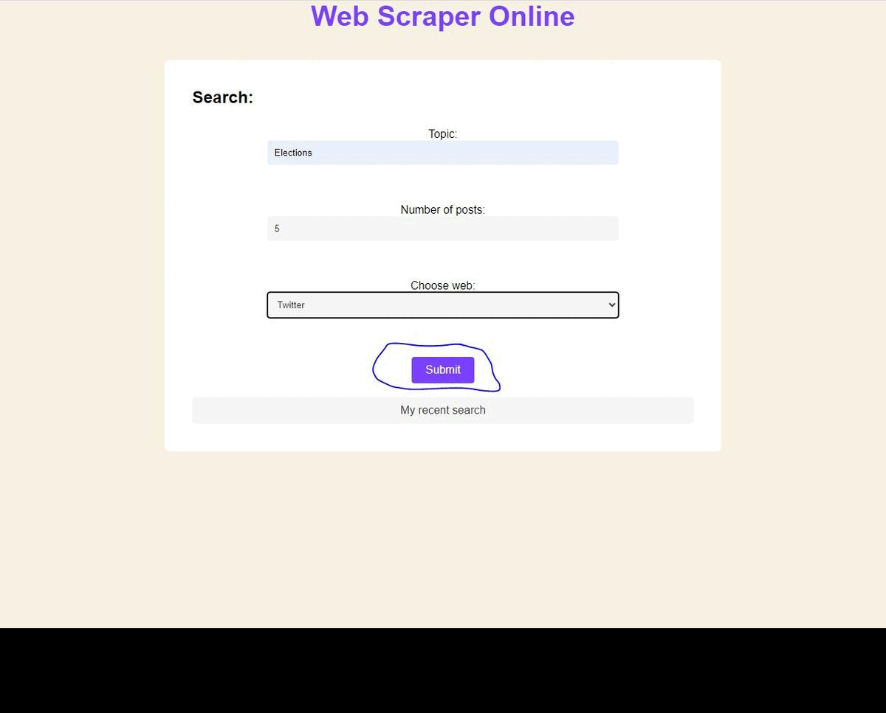

# Web Scraping from Twitter and Reddit
This project is a web application that allows users to scrape data from Twitter and Reddit by entering a topic, choosing the number of posts, and selecting the website (Reddit or Twitter). The scraped data is then saved to a MongoDB database, and the user can export it to a CSV file.

## Technologies Used
- Django Framework
- MongoDB Database

## Dependencies
The following packages are required to run the application:
- Django
- pymongo
- snscrape
- praw <br><br>
These packages can be installed by running the following command:
    
    ```sh
    pip install -r requirements.txt 
    ```

## Installation and Usage
1. Install the required packages using the command above.

2. Make sure that MongoDB is installed and running on your computer with the following connection: mongodb://localhost:27017/.

3. Clone the repository to your local machine:
      ```sh
    git clone https://github.com/epsAriel/WebScraper.git
    ```

4. Navigate to the project directory and run the following command to start the Django development server:

    ```sh
    python manage.py runserver
    ```

5. Open your web browser and go to http://localhost:8000/ to access the application.

6. Enter a topic, choose the number of posts, and select the website (Reddit or Twitter).

7. Click the "Submit" button to scrape data from the selected website.

8. The scraped data will be saved to a MongoDB database.

9. To export the data to a CSV file, click the "Download CSV" link.

## Usage video


## Credits
This application uses the following packages:

- Django: https://www.djangoproject.com/
- pymongo: https://pypi.org/project/pymongo/
- snscrape: https://github.com/JustAnotherArchivist/snscrape
- praw: https://github.com/praw-dev/praw
